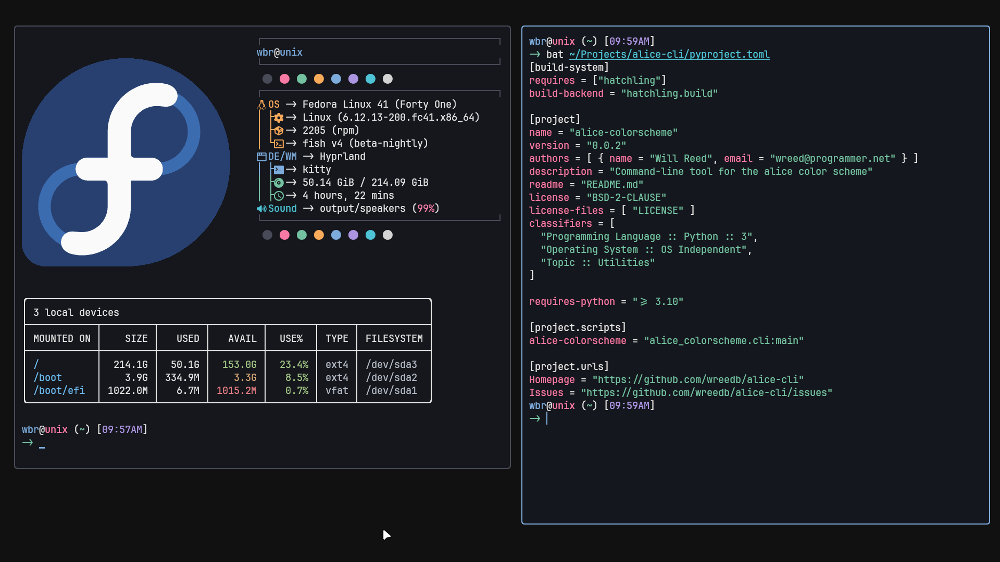

This is `alice-cli`, a querying tool for my colorscheme **Alice**.

## usage
```sh
# format can be hex, rgb or hsl
# scheme can be normal or bright
alice-colorscheme --scheme normal --format hsl
# or for a specific color [black/red/green/yellow/blue/magenta/cyan/white]
alice-colorscheme --scheme bright --format rgb --color green
```

| Feature           | Status  |
| ----------------- | ------- |
| hex color output  | done    |
| rgb color output  | done    |
| hsl color output  | done    |
| cli color preview | planned |

<p align="center">
  
</p>
